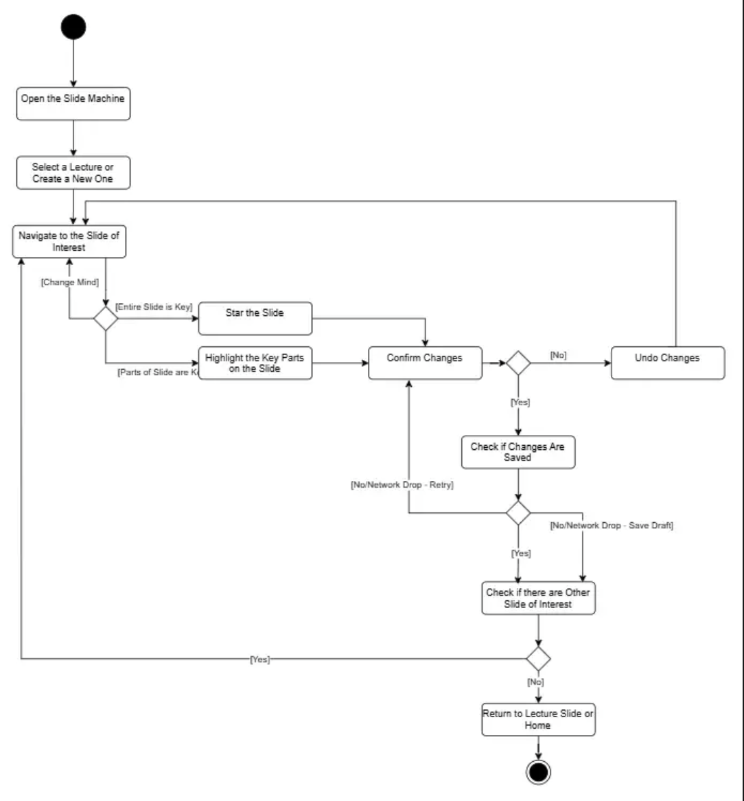
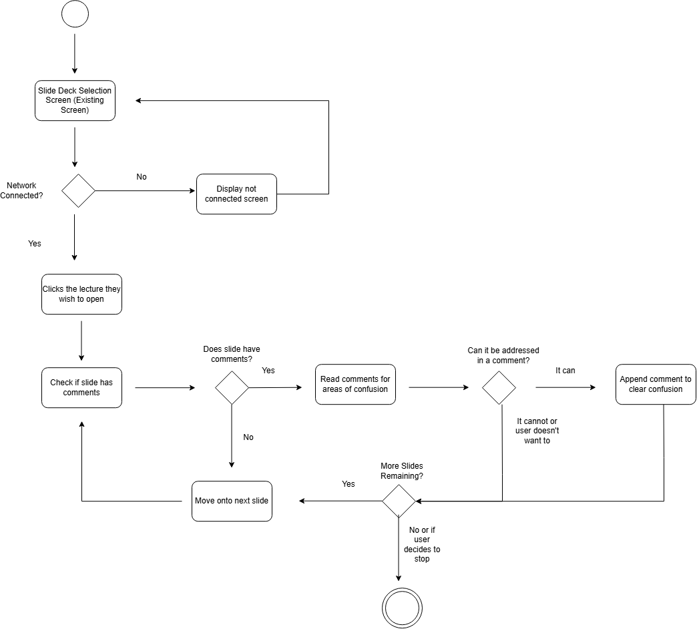

# Specification Phase Exercise

A little exercise to get started with the specification phase of the software development lifecycle. In this exercise, your team specifies a set of improvements and new features for [The Slide Machine](https://theslidemachine.com) — see the [instructions](instructions.md) for detail, and the [background](background.md) for an introduction to the software product you are tasked with extending.

## Team members

[Jack Jiang](https://github.com/jack-k-jiang)
[Ruikun Xu](https://github.com/xuruikun)
[Shuo Cao](https://github.com/ShuoWu6529)
[Ronald Szeto](https://github.com/ronaldszeto)
[Eric Wu](https://github.com/ew2725)

## Review of the Current Application
Strength:
* The generation of the slides, text, images, etc. is fast. There is little delay in the words being spoken being outputted into slides. 
* Overall, program summarizes the spoken information quite well within its paragraph and bullet point heavy format. The speak aloud feature also fits the slide.

Weakness: 
* Text is sometimes repeated, whether from when the user repeats something or with the seed material. Doesn't support different colors for text or highlighting for sentences.
* The project title of a slides project changes to match whatever was discussed most recently, and it shifts easily when the lecturer goes off on a tangent. As a result, a project's title often does not describe the lecture as a whole. This makes it easy to mistake one project for another when trying to find a relevant deck or slide later.
* Correcting inaccurate content adds new slides rather than editing the original material. This inflates presentation length, forces tedious manual cleanup, and breaks the flow between the slides. Treating user feedback as an additive history log instead of an inline edit creates significant workflow friction.
* The software has poor math integration for the slides. For example, telling the slides to give an example of the sample space of flipping a coin would be omega equals to H and T inside brackets would result in words. Then after asking it to represent it mathematically, the program would write up LaTeX code without compiling it unless told to.
* The software doesn't support multi-language translation. This would be really helpful in a language class where someone can speak in two languages and the program would be able to output text in both languages to support translation.

Gap:
* A slide doesn't seem to be able to show more than one generated image, so side-by-side comparisons are not possible. Generating a table doesn't work either, and neither do diagrams. When asked to generate images side by side, the app produces only one image for the slide, as well as text saying that it is comparing. Lectures that compare two things (before and after, two examples, two historical figures) cannot be illustrated as such.
* There is a lack of presenter mode that Google Slides and Powerpoint has. More specifically, Google Slides and Powerpoint both offers presenter mode that allows you to view your speaker notes and timer in another tab.
* The software relies strictly on photos and bullet points and lacks support for other functionality like tables, shapes, charts, and diagrams. This makes the slides struggle with effectively displaying complex data, such as side-by-side comparisons. Without this ability it forces standard formatting tools and limits its use to lower-complexity and heavier text slides.

## Prior Art & Originality

We looked at the Future Work and Open Questions in the SPEC.md and closed/open PRs in the Slide Machine repository. We saw that there wasn’t any student accessibility support in the current implementation of Slide Machine, nor was it mentioned in Future Work. We do see that there is an option for the instructor to make a quiz from the slides, but not for the students to do so. We propose student-oriented accessibility features such as generating a study guide, flashcards, and a practice quiz organized by slides/topic. 

## Stakeholders

### Students

- EW is a first-year masters student at NYU Wagner for a MPA in Public & Nonprofit Management & Policy. His primary goals for creating slides are to create slides for classwork presentations and to update slides at his internship for annual training policies for working professionals. 

    When he first tested The Slide Machine for creating slides for classwork and study, he found it frustrating that the AI couldn't convey information with more detail but it instead gave the main idea of everything he said and that it couldn't generate images that he needed. For example, he tried to generate a graph of South Korea's GDP from a certain time frame but the AI just generated text stating his prompt. Another problem he faced was that he couldn't reference older slides when discussing a topic. For his internship, one of his goals is to be able to update slides for new training policies, and also prefers for The Slide Machine to create header and title slides rather than producing a unique header for each slide. He also discussed a need for being both a student and a worker; he never often creates slides on the spot during a lecture but rather creates scripts off of premade slides to present. He also wants to be able to practice his time management skills while presenting slides by having a timer for each slide.

- JC is a senior Game Design student at the NYU Tisch Game Center. He mainly uses slides for pitching game ideas, advertising finished projects, and putting together research reports. For all three, he relies a lot on diagrams and images to get gameplay flow and design ideas across, since those are hard to explain in words alone. As a design student he also cares about how a presentation feels, not just what it says, so he likes to use varied transitions between slides to keep a pitch visually interesting.

When he tried The Slide Machine for the first time, his biggest complaint was that he couldn't place images where he wanted them. The system decided where an image went instead of letting him direct it. He also had no way to sketch out a quick diagram using basic shapes and connect them together, which is how he'd normally show a gameplay loop or a system interaction. When the seed-image feature was explained to him, he wasn't sold on it. In his opinion, if he still has to make and place his own diagrams ahead of time, he figured he might as well just build the whole deck himself by hand, which kind of defeats the point. He also wants more say over transitions and pacing than a content-only generator gives him, and he wasn't sure the tool could keep up with the quick back-and-forth a game pitch needs, jumping from a diagram to a screenshot to a comparison slide in a matter of seconds. 

- MC is a junior Game Design student at the NYU Tisch Game Center. She mostly uses slides for class presentations, and her habit is to plan the shape of a deck before she knows exactly what goes in it. She'll list out the sections she wants first, like title screen, overview, mechanics, thank you, and fill in details after.

That workflow didn't match how The Slide Machine works. It couldn't generate that outline of slides ahead of time from something she said, so she couldn't lay out her structure first and then talk through the content. She had to figure out structure and content at the same time, which threw off how she normally works. She also found the tool too literal. When she said something like "write down the year pizza was invented," she wanted it to actually look that up and put the answer on the slide, not just transcribe what she said word for word. That points to something she'd want going forward: a bit of built-in research or fact-checking, not just speech capture. She also wanted to be able to reorder or rename sections mid-talk, since she sometimes realizes partway through that "mechanics" should really come before "overview." And she wanted a way to mark a section as finished so the system would stop adding new content to it once she'd moved on, because otherwise it was hard to tell which parts of the deck were actually done.

### Instructors
- Prof. J is a professor at NYU Tandon who teaches Electrical Engineering to graduate students. He first established that his goals are to transfer knowledge to students and help them develop critical thinking skills. He wants to help students gain skills for present topics involving problem-solving, as well as skills needed for the future that are centered more around research and developing new approaches. Additionally, Prof. J said that grades in one of the classes he teaches are very varied, and he hopes that all of his students will perform better on exams. 

  One of the problems and frustrations he mentioned was that attendance in his in-person classes was sometimes lacking. He said this could be attributed to the fact that graduate students are sometimes too busy to attend class because of responsibilities such as part-time jobs. Prof. J also said that graduate students often believe they are more capable of self-studying topics. He gives students practice questions in PDF format that are based on lecture notes. He does not give sample tests, such as previous exams, because he believes they would not be helpful for current exam questions. He said that he believes practice exams are useful but does not believe in reusing old exams. 
  
  Regarding his opinions on Slide Machine, while giving a mock lecture, he noted that he was speaking more to the AI than to the actual class and students. Slide Machine also had trouble generating equations and diagrams when he asked for them, and he often had to repeat himself before an equation or diagram was generated. He believes that Slide Machine would not be useful for his subject, graduate-level Electrical Engineering, because the material is too complex for the AI to reliably generate useful equations and diagrams. However, he said that the exit ticket form is a good idea for providing students with practice and is also a good way to gauge their understanding of the lecture.

- Prof. F is a professor at NYU who teaches and administers exams for Cantonese. She explained how she doesn't use slides typically as she believes that they are unhelpful in most situations to truly cement knowledge into students. 

  In her Cantonese courses, she typically relies on spoken dialogue and repetition to learn words and phrases effectively. She noted how most students relied mostly on practice and reading material wasn't the main way students understood material. Some problems and frustration she said were how some students would attempt to use AI tools for certain assignments as it slowed their progress in learning the language. Practicing is a difficult process for some and she noted and how certain tools like flashcards were excellent in helping memorization. 
 
  While using the Slide Machine, she expressed frustration on the fact that its speech to text software was unable to track any phrases in Cantonese or even Mandarin. She expected this but also noted how she didn't like how she would need to focus on managaing the AI if she wanted it to generate useful information. Even while speaking in English, it seemed very distracting constantly going back and forth with the AI and asking it to change something.
  She noted that it seems useful for other subjects but needed things like multilingual support, flash cards, and less managment to make it something useful for more people.

- Prof. EZ is a professor at the NYU Tisch Game Center who teaches game design. His main goal is making abstract design theory concrete enough for students to actually understand and use, rather than just memorize and repeat back. In service of that, he also wants to build students' critical thinking and their ability to iterate quickly through design ideas, since theory only sticks for his students once they can apply it to a real design problem.

His biggest frustration with The Slide Machine was around visuals and complex ideas, both of which don't work as intended. Game design lectures lean a lot on things like diagrams and storyboards that show how a mechanic works, and he found the tool wasn't great at producing those on the fly. It tended to fall back on text summaries where a diagram was really needed, which works against making a concept concrete. Once he got into higher level theory, he also noticed the tool had trouble keeping concepts separate. It would blend related ideas together on one slide, or carry a term from one concept into the next, instead of drawing a clean line between them the way his own notes do. That made it hard to reproduce his usual style of teaching. He also felt it didn't distinguish well between an example meant to illustrate a concept and the concept itself, which made things more difficult to understand.

He also ran into a strange language issue while testing on a different device, one whose system language was set to Chinese. Even though he spoke the entire time in English, the slides that came out were generated in Chinese. Saying explicitly that a given slide should be in English would fix that one slide, but as soon as he stopped calling it out, the next slide would drift back to Chinese on its own. He found this odd, since he never switched languages himself and the correction never stuck. He liked the idea of the exit ticket quiz in principle, but only if the questions could reliably target the actual frameworks he covered instead of staying at a surface level.

## Product Vision Statement

Our contribution extends The Slide Machine’s speech-generated slide decks into instructor-guided study. Instructors can better shape how their lecture slides are reviewed, while students turn the slides into personalized study guides, flashcards, and practice questions.

## User Requirements

### Instructors
<!--As a [type of user], I want [some goal] so that [some reason].", where [type of user], [some goal] and [some reason] are replaced with appropriate values. Keep them small and written in non-technical language that the type of user would use.-->
1. As an instructor, I want to select which lectures are included in an exam study collection so students know which course material is relevant.
2. As an instructor, I want to see which topics students struggle with on practice quizzes so that I know what to review.
3. As an instructor, I want to read student comments attached to a specific slide so that I can understand why students are confused.
4. As an instructor, I want to see what type of problem students report on a slide so that I know whether the issue is the explanation, example, image, or accuracy.
5. As an instructor, I want to see how many students are using the study materials so that I can tell whether the resources are useful.
6. 
7. 
8. 
9. 
10. 

### Students

## Activity Diagrams

### UML Activity Diagram 1
**Instructor User Story 6:** As an instructor, I want to be able to mark specific slides or highlight text as key materials, so that students know what topics to focus on when reviewing

### UML Activity Diagram 2
**Instructor User Story 3:** As an instructor, I want to read student comments attached to a specific slide so that I can understand why students are confused

## Wireframes

See instructions. Delete this line and place your wireframe diagrams here, covering every new screen and every existing screen your proposal changes, for every type of user.

## Clickable Prototype

See instructions. Delete this line and place a publicly-accessible link to your clickable prototype here.

## Stakeholder Demo

See instructions. Delete this line and place a link to the deck The Slide Machine generated during your presentation here, after you have presented.

## Exit Ticket

See instructions. Delete this line and place a link to the exit-ticket quiz you generated from your demo deck and distributed to the class, along with a short note on what — if anything — you had to correct in the generated questions before publishing.
